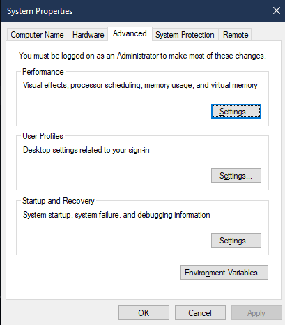
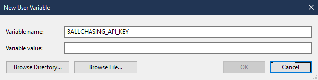

# Ballchasing Stat Scraper in Python

This script is a refactor of another developer's work. Credit will be updated when available.

## Setting Up Ballchasing API Key

### Windows
1. Open Start and search for "Environment Variables".
2. Click "Edit the System Environment Variables".
3. Click "Environment Variables" at the bottom right corner .
4. Under the Users section, click "New" .
5. Set Variable Name to `BALLCHASING_API_KEY`.
6. Set Variable Value to your unique API key.
7. Restart your PC for changes to take effect.

### macOS and Linux
- [macOS Guide](https://support.apple.com/guide/terminal/use-environment-variables-apd382cc5fa-4f58-4449-b20a-41c53c006f8f/mac)
- [Linux Guide](https://www.freecodecamp.org/news/how-to-set-an-environment-variable-in-linux/)

## Installing Prerequisites
1. Clone the repository.
2. Run `pip install argparse json pandas requests`.

## Creating URL JSON File
Create a `urls.json` file in the script directory with your group URLs:
```json
[
    "https://ballchasing.com/group/rtku4-rl-wk9-griffins-vs-pegasus-jah697qbqy"
]
```

## Running the Script
Execute the script from the terminal:
```
python bc_scraper_refactor.py urls.json
```
An output directory will be created for the CSV files. Note: Existing CSVs with the same name will be overwritten.
